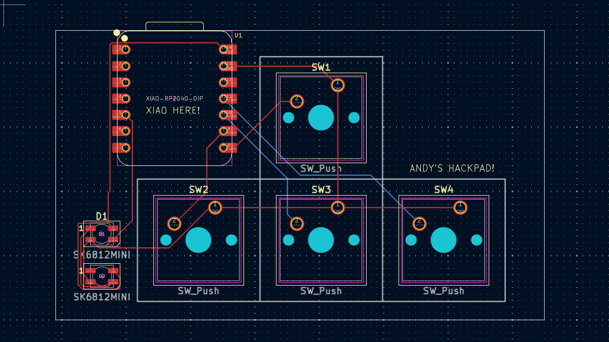

# Macropad
---

## 🧠 Inspiration
This was my first time building a macropad, and I wanted to create something small and simple to use. I’ve always liked to play games, and I thought: why not make a compact little WASD/arrow keys? 

---

## 🚧 Challenges
There were a lot of firsts in this project. It was my first time using Fusion 360 and KiCAD, and it took me a while to ship. But even with all the Googling and trial and error, I’m really proud of how it turned out. It wasn’t perfect, but it was a huge learning experience that got me more comfortable with CAD and hardware design.

---

## 📦 Bill of Materials (BOM)
- 4× Cherry MX Switches  
- 2× SK6812 MINI LEDs  
- 1× Seeed XIAO RP2040  
- 4× Blank DSA Keycaps  
- 4× M3x16 Bolts  
- 4× M3 Heatset Inserts

---

## 📸 Images

  
  

